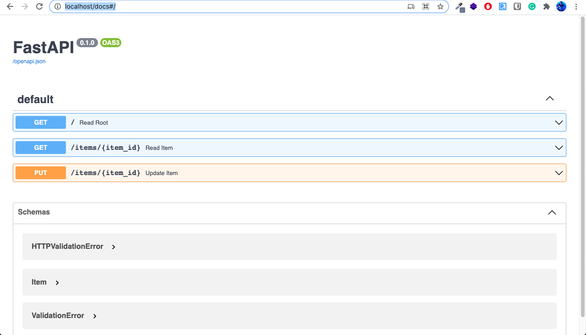
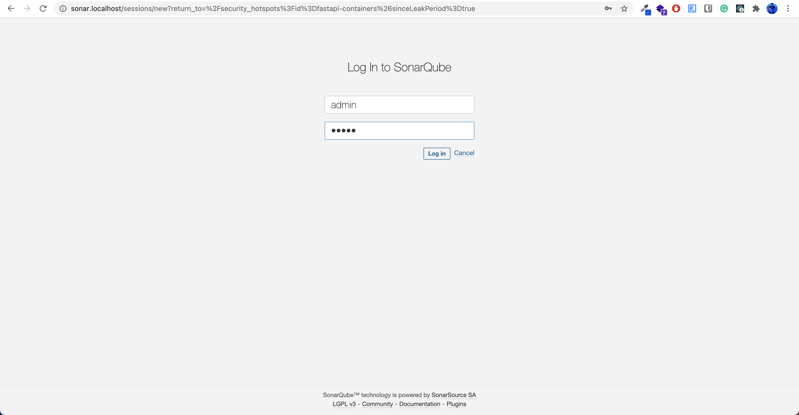
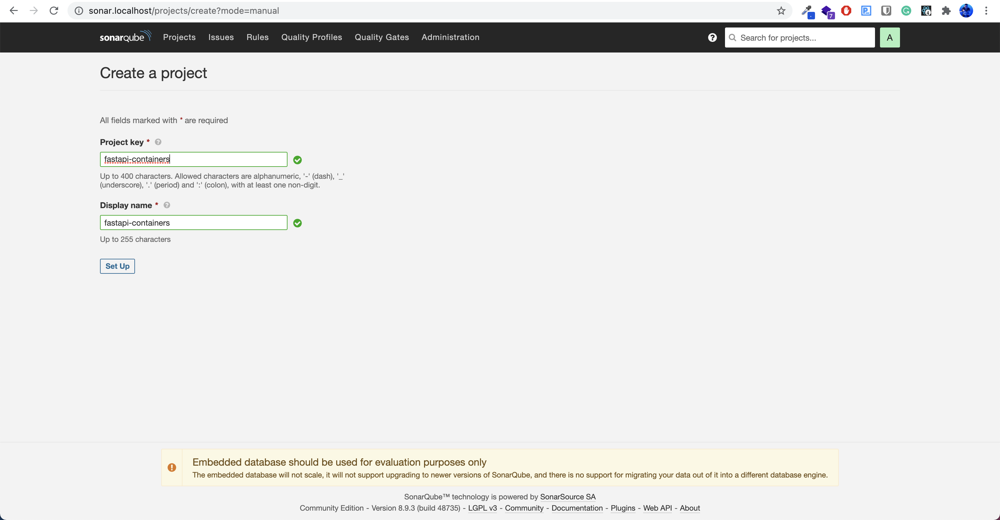
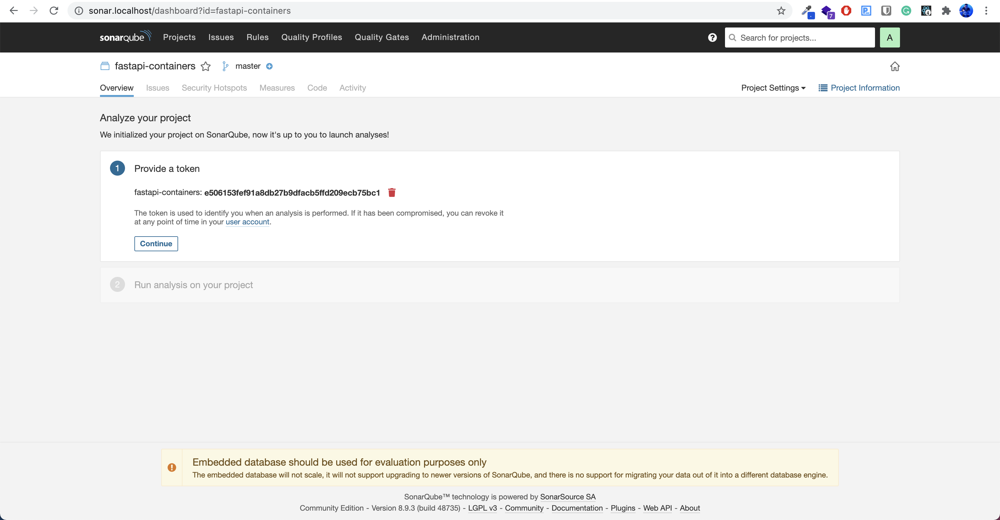
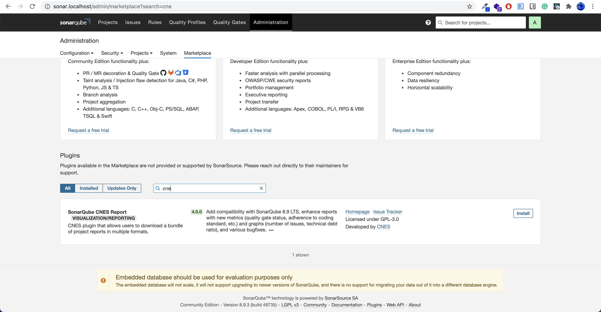
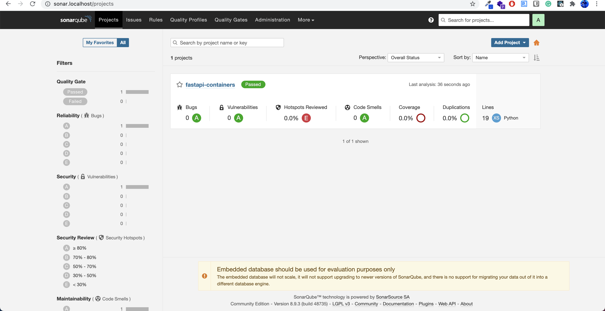
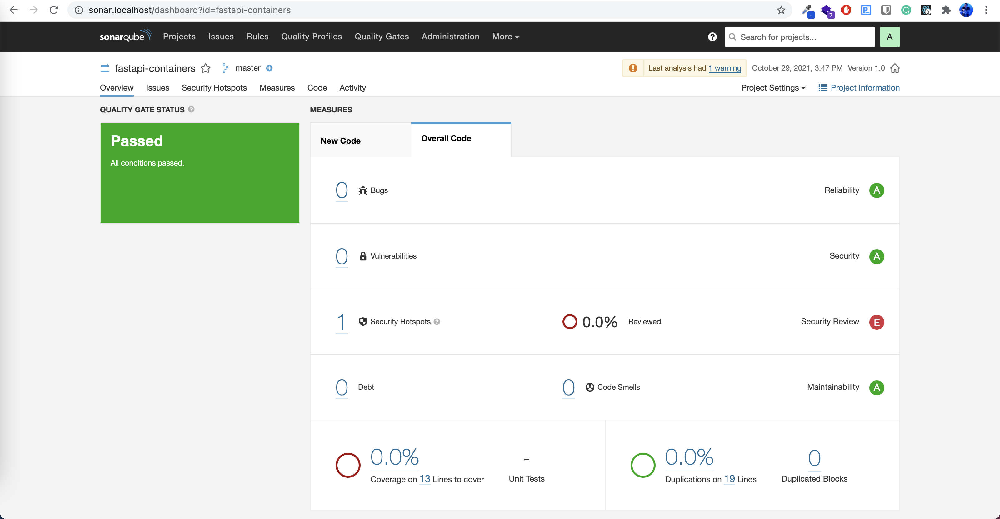

# fastapi-containers

## Clone

Please run the following commands.

```
git clone https://github.com/jonra1993/fastapi-containers.git
cd fastapi-containers
```

## Docker Compose

This repo is very easy to install and deploy in a Docker container.

By default, the Docker will expose port 80. It uses FastAPI Python async backend and Nginx as reverse proxy.

```sh
docker-compose up
```

Open a browser and go to http://localhost/docs, you should see a screen of Swagger documentation.



To stop containers run:

```sh
docker-compose down
```

## SonarQube testing
This docker-compose file already has SonarQube server.
For consfigure SonarQube please follow these steps.

Open http://sonar.localhost/ on your pc. You should use this credentials:

user: admin and password: admin



Create a new project 


Create a new token and save it


Go to Administration/Marketplace and install "SonarQube CNES ReportVISUALIZATION/REPORTING" plugin. This will requiere you to restart the server.


Edit sonar-project.properties file with your project data

```sh
# must be unique in a given SonarQube instance
sonar.projectKey=fastapi-containers

# --- optional properties ---

# defaults to project key
sonar.projectName=fastapi-containers
# defaults to 'not provided'
sonar.projectVersion=1.0
sonar.projectDescription = 'Description for "My App" project...'
sonar.exclusions = 'traefik/**.* sonarqube/**.* static/**.*'

# Path is relative to the sonar-project.properties file. Defaults to .
#sonar.sources=.
 
# Encoding of the source code. Default is default system encoding
sonar.sourceEncoding=UTF-8
```

### Docker RAM.
Docker should increse the RAM from 2Gb to 4Gb to aviod hang container when running the scanner.


### Docker Scanner
Run the follow command depending of you OS. In a terminal you should change the SONAR_LOGIN variable

#### Windows Command line
```sh
docker run --network=fastapi-containers_default --rm -e SONAR_HOST_URL="http://sonarqube-container-fast:9000" -e SONAR_LOGIN="c0c2bdecce6a849ffa7f80f839f9a112a9bfaa3d" -v "%cd%:/usr/src" sonarsource/sonar-scanner-cli
```

#### Windows Power Shell
```sh
docker run --network=fastapi-containers_default --rm -e SONAR_HOST_URL="http://sonarqube-container-fast:9000" -e SONAR_LOGIN="c0c2bdecce6a849ffa7f80f839f9a112a9bfaa3d" -v "${PWD}:/usr/src" sonarsource/sonar-scanner-cli
```

#### Mac and Linux
```sh
docker run --network=fastapi-containers_default --rm -e SONAR_HOST_URL="http://sonarqube-container-fast:9000" -e SONAR_LOGIN="c0c2bdecce6a849ffa7f80f839f9a112a9bfaa3d" -v "$(pwd):/usr/src" sonarsource/sonar-scanner-cli
```

When you return to SonarQube panel you will have the result of scanning



### Export report
Go to More/CNES Report and choose you project, this is going to download a text report 


## License

[](http://badges.mit-license.org)

- **[MIT license](http://opensource.org/licenses/mit-license.php)**
- Created by <a href="https://www.jonathanvargas.ml" target="_blank">Jonathan Vargas</a>


